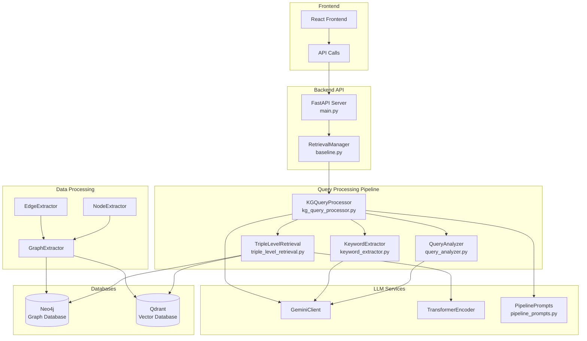
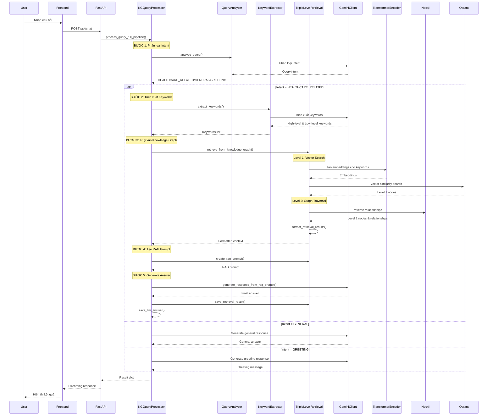
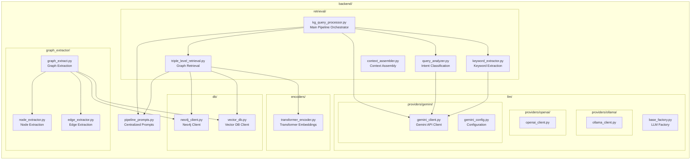
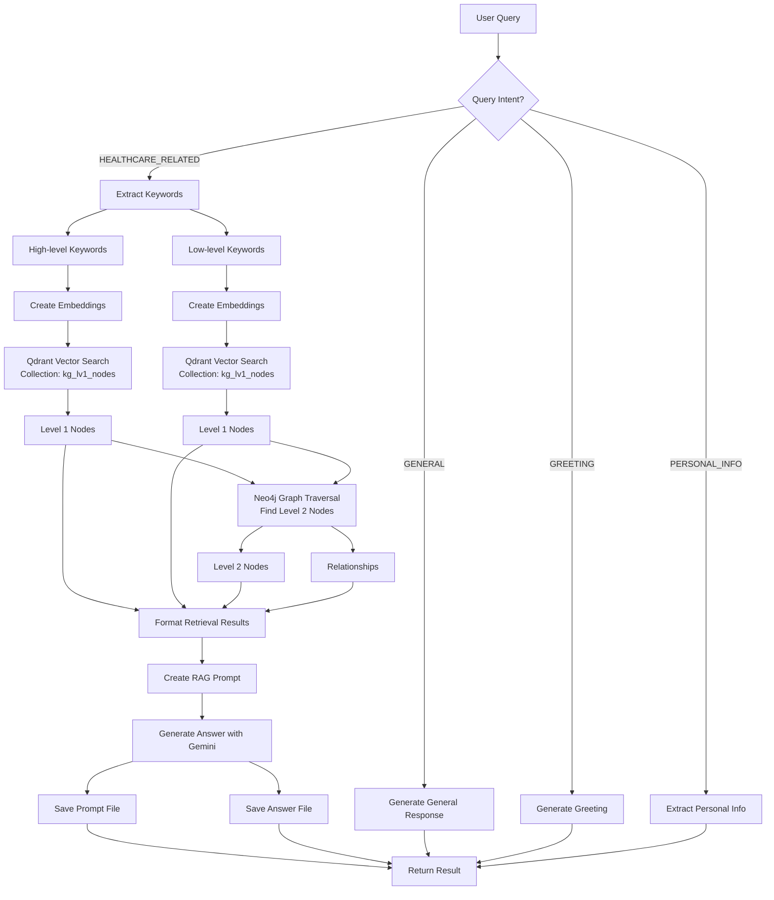
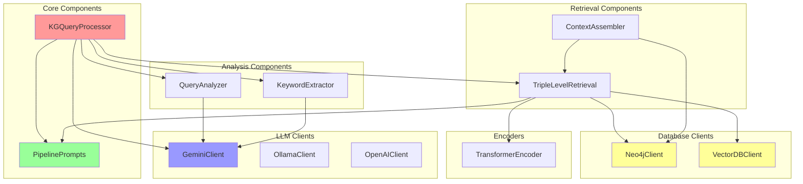
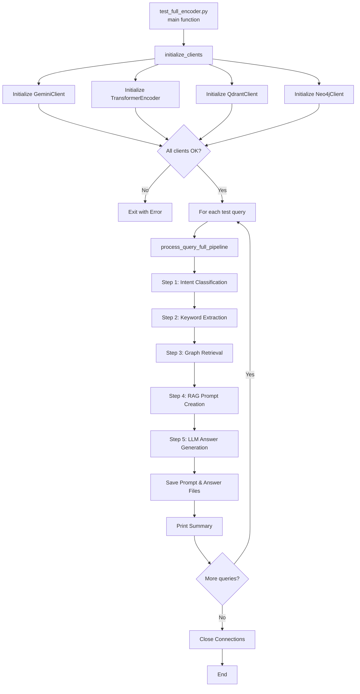
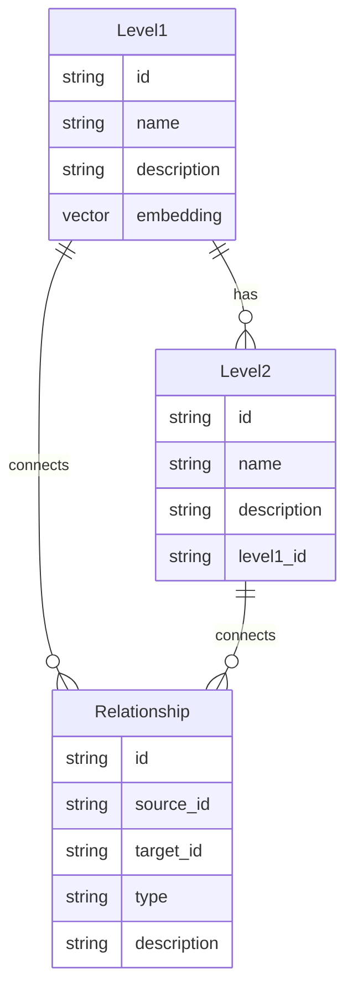
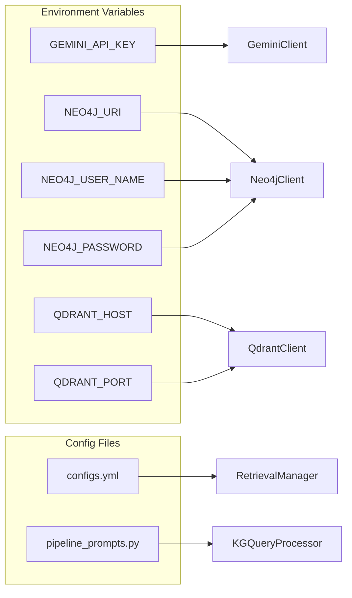

# Biểu Đồ Kiến Trúc Hệ Thống KGChat-03

## 1. Kiến Trúc Tổng Quan



## 2. Luồng Xử Lý Query Chi Tiết



## 3. Cấu Trúc Module Backend



## 4. Data Flow - Knowledge Graph Retrieval



## 5. Component Dependencies



## 6. Test Flow



## 7. File Structure Overview

```
KGChat-03/
├── main.py                          # FastAPI entry point
├── backend/
│   ├── retrieval/
│   │   ├── kg_query_processor.py    # Main pipeline orchestrator
│   │   ├── query_analyzer.py       # Intent classification
│   │   ├── keyword_extractor.py    # Keyword extraction
│   │   └── triple_level_retrieval.py # Graph retrieval
│   ├── llm/
│   │   └── providers/gemini/        # Gemini LLM client
│   ├── db/
│   │   ├── neo4j_client.py          # Neo4j graph database
│   │   └── vector_db.py             # Qdrant vector database
│   ├── encoders/
│   │   └── transformer_encoder.py  # Transformer embeddings
│   ├── graph_extractor/             # Graph extraction tools
│   └── pipeline_prompts.py          # Centralized prompts
├── test_full/
│   └── test_full_encoder.py         # Full pipeline test
└── frontend/                        # React frontend
```

## 8. Key Functions và Responsibilities

### kg_query_processor.py
- `process_query_full_pipeline()`: Main entry point cho toàn bộ pipeline
- `process_kg_query()`: Xử lý query với knowledge graph
- `generate_response_from_rag_prompt()`: Generate LLM response từ RAG prompt
- `_generate_healthcare_response_with_rag()`: Healthcare response generation
- `_generate_general_response_with_rag()`: General response generation
- `_generate_greeting_response()`: Greeting response generation
- `save_llm_answer()`: Lưu LLM answer vào file

### triple_level_retrieval.py
- `retrieve_from_knowledge_graph()`: Retrieve từ knowledge graph
- `format_retrieval_results()`: Format kết quả retrieval
- `create_rag_prompt()`: Tạo RAG prompt từ context
- `save_retrieval_result()`: Lưu retrieval result vào file

### query_analyzer.py
- `analyze_query()`: Phân loại intent của query
- `QueryIntent`: Enum định nghĩa các loại intent

### keyword_extractor.py
- `extract_keywords()`: Trích xuất high-level và low-level keywords

## 9. Database Schema



## 10. Configuration và Environment



---

**Ghi chú:**
- Tất cả các biểu đồ được tạo bằng Mermaid syntax
- Có thể render bằng các công cụ như Mermaid Live Editor, GitHub, hoặc VS Code extensions
- Biểu đồ mô tả kiến trúc và luồng xử lý của hệ thống KGChat-03

